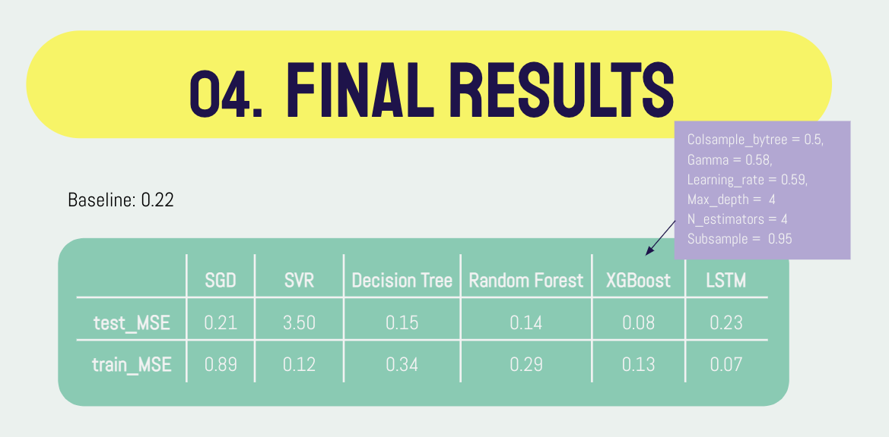

# Machine_learning_final_project
Final Project for Machine Learning Fall 2020

In this project we investigate six machine learning model trying to find the best models for pridecting the daily death toll of covid-19 in the U.S. This project includes:
-	Data collection and processing: Extracted and cleaned three open-source databases to form a master database containing daily pandemic data from 2020/04/02 to 2020/11/02 for all 50 states in the United States.
- Model construction and results: Conduct experiments on six machine learning models LR, SVM, Decision Tree, Random Forest, XGBoost, and LSTM to predict the new coronary epidemic using time series data. Finally obtained a 75% improvement in performance compared with the base model and delivered an 11-page academic paper

## Video Presentation
https://docs.google.com/presentation/d/1QOzpF2lW0dHHNY0XW73C4p2GOzDjYkGCy-eJc48qQzQ/edit?usp=sharing
## Result

